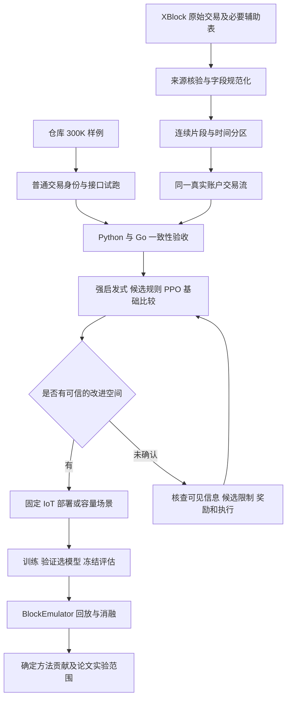

# 真实链上交易与 IoT 场景：整体实施规划 v1

更新日期：2026-09-11。状态：总体方案已确定，尚未实施本规划中的代码改造、正式数据下载或新实验。

本次交付仅为这份说明文档。后续按阶段补充本文件中的参数、字段映射和验收结果。既有实验、原始数据和历史结果保留，不把旧结果改名为新路线结果。

## 1. 目前确定的路线

采用导师建议：**先用真实区块链交易的小规模样例验证现有首次放置系统，再为真实交易添加明确、可复现、与系统成本相关的 IoT／边缘部署场景。**

整体研究对象仍是“新账户／状态首次出现时，应该放入哪个分片”。保留现有候选筛选、PPO、离线训练、BlockEmulator 回放和结果统计框架。PPO 是否成为论文主方法，由它相对于强启发式的实测增量决定。

总体执行次序：

1. 用仓库自带的 `selectedTxs_300K.csv` 做普通交易身份路径的接口验证。
2. 从 XBlock 获取来源和顺序可核实的交易数据，构造可复现的正式实验片段。
3. 在不添加 IoT 特征的情况下，先比较强启发式、候选规则和 PPO。
4. 基础流程与结果可信后，再添加一种明确的 IoT／边缘部署约束。
5. 做特征、候选机制和 PPO 的消融，再扩大数据量与实验范围。

共享任务语义保留为后续 IoT 业务补充方案；当前不同时全面推进三条数据路线。直接把旧 `related anchors` 均匀展开成交易，不作为主要改进方向。

### 1.1 为什么采取这条路线

原 IoT 数据将设备身份写进状态标识，实际执行主要是 `state_object → primary owner`。虽然输入特征存在其他锚点，但它们不自动构成执行交易。这样会使“跟随所属设备放置”成为很强的规则。

2026-09-11 的全量结构统计进一步发现：

| 数据定义 | 交易数 | 唯一待放置状态数 | 结构上的主要限制 |
|---|---:|---:|---|
| 原 IoT 定义 | 4,944,019 | 76,015 | 每个状态的实际设备交易对手固定 |
| 所有 related 均匀展开 | 11,282,736 | 76,015 | 每个状态的各关联者交易次数完全相等 |
| 保守双参与方，含单方回退 | 8,071,743 | 76,015 | 每条事件都有一次 owner 操作、至多一次 peer 操作 |
| 已固定的每小时共享任务 | 4,944,019 | 19,454 | 存在多设备访问，但业务分组与任务时间规则属于仿真假设 |

在固定锚点、只最小化跨片交易数、不考虑容量和队列的条件下，全 related 版本的首次批次多数规则已达到离线最小跨片数；保守双参与方版本的跟随 owner 规则也达到该最小值。上述结论不是“所有目标下 PPO 都无用”，但不支持通过简单复制交易来解决当前问题。

真实交易路线可以先排除这类人为固定关系，让实际 `from/to` 关系直接决定账户交互图。它也不能保证 PPO 有效果，需要先做小规模验证。

### 1.2 目前的研究问题与边界

第一阶段问题：在相同的当前批次信息和历史负载信息下，PPO 是否比强规则产生更好的账户首次放置结果？

第二阶段问题：当账户部署、分片处理能力或链路条件存在明确差异时，利用这些场景信息能否改善实际处理表现或有定义的模型成本？

本轮最小方案不引入状态迁移、多副本、一致性协议重构、完整 EVM 执行或等待多个未来窗口后放置。这些属于后续独立扩展，不是当前启动条件。

## 2. 先用 300K，还是先从 XBlock 下载

**先用仓库 300K 做接口试跑；正式对照前使用从 XBlock 下载并核验的数据。两者用途不同，不需要二选一后一直沿用。**

### 2.1 仓库 300K 的用途

文件：[selectedTxs_300K.csv](E:/project_iot/block-emulator-main-iot/selectedTxs_300K.csv)。

2026-09-11 按当前普通交易解析规则统计：

| 项目 | 数量 |
|---|---:|
| CSV 行数及有效交易数 | 300,000 |
| 不同账户数 | 54,403 |
| 全程有多个实际交易对手的账户 | 17,456 |
| 首次 1,000 笔交易批次中有多个对手的账户，包含未放置者 | 7,560 |
| 首次批次已有至少两个此前批次出现过的对手的账户 | 5,271 |

这些数字说明样例中存在真实执行账户对所构成的多对手结构。它们不等于独立训练样本量，也不证明全部账户都需要由 PPO 决策；具体动作数取决于初始化和新账户处理规则。

这份精简文件缺少完整交易哈希、区块和时间字段，尚未核实其原始抽样方式和顺序连续性。因此适合：

- 首批少量记录的解析、地址保持和新账户识别检查。
- 1 万至 3 万笔交易的 Python／Go 执行一致性试跑。
- 全部 30 万笔的结构诊断、运行时间估计和小规模算法筛查。

不直接用它支持正式的时间泛化结论。若需临时验证训练、选模型、评估接口，可按文件顺序暂分 20 万／5 万／5 万；必须标注“接口验证分区”，不将其表述为已核实的真实时间切分。

### 2.2 XBlock 的用途和下载次序

导师提供的入口：[XBlock Ethereum 数据入口](https://www.xblock.pro/#/dataset/14)。项目现有 BlockEmulator 文档也引用此入口。XBlock-ETH 的数据来源与类别可见其[数据论文](https://arxiv.org/abs/1911.00169)。

2026-09-11 核对情况：静态读取仅得到网站外壳，动态详情页未成功加载；**尚未核实当前可下载文件的完整清单、单文件大小、字段版本和镜像可用性**。以下为选择标准，不是已经选定或下载的文件。

后续进入页面后优先查找：

1. Ethereum 链上数据中的普通外部交易表，例如页面实际提供的 `BlockTransaction` 类数据。
2. 能恢复 `block_number` 和区块内交易顺序的文件；时间戳可能需与区块表关联。
3. 若交易表没有执行成功状态，查找可通过交易哈希关联的 receipt／状态信息。
4. 若需要区分普通账户与合约账户，再检查合约信息表；第一轮不以它为强制前提。

先下载能够覆盖一个连续区块区间的最小必要文件。文件名中诸如“2000000–2999999”的范围可能指区块高度，**不能直接当作一百万笔交易**。读取表头、数据说明和实际记录数后再决定是否需要相邻文件，不先全站下载。

如果必须整包下载，先保留原压缩包，按表头和区块范围抽取连续片段，不需要把所有表都解压到项目中。正式片段的规模以有效记录数、待放置账户数和试跑耗时决定，不能只看压缩包大小。

**具体安排：300K 接口检查可以先开始；XBlock 数据来源核验可同步准备；在长期训练、Top-K 搜索和正式对照之前完成切换。**

## 3. 整体流程



这里的“生成新数据集”，主要是规范化链上交易并补充场景元数据。**不再为每个 from/to 组合生成一个设备私有状态，也不自动增加额外链上交易。**

## 4. 账户、状态和交易重新如何定义

### 4.1 保留真实账户身份

基本交易表示为：

```text
e = (tx_id, block_number, transaction_index, timestamp,
     from_address, to_address, value_wei, optional_metadata)
```

区块链账户地址本身对应待维护的账户状态。账户首次出现在当前放置映射中之前，需要确定所属分片；已经放置的账户保持原位置。

示意例子，以下字母不是已选 XBlock 文件中的实际账户：

```text
同一当前批次：
A → S
B → S
C → T

如果 A、B 已放置而 S 未放置：
S 的真实交易对手包括 A 和 B；S 只放置一次。
下一批 A → S 继续访问相同的 S，不另建 S_A。
```

不生成 `state:(device=A, peer=S)` 与 `state:(device=B, peer=S)` 来代替同一个 S。这样才能保留原始交易图中的账户复用。

### 4.2 执行范围先采用账户对回放

最小实现继续使用 BlockEmulator 已有账户余额／转账与 relay 处理路径，研究账户对造成的跨片与负载问题。

- `from/to` 是实际回放的账户对。
- `value_wei` 使用整数或十进制整数字符串保存，禁止浮点数损失精度。
- 不把金额当作 payload 字节数、gas 或交易次数。
- 对合约调用，只有账户对回放时，应说明保留了外部调用关系，而未重现全部合约状态读写与内部调用。
- 如果后续只研究普通 ETH 转账，必须根据真实字段给出过滤规则并统计保留率；不能把当前精简 CSV 的列位置判断直接当作普通转账识别规则。

初始余额、nonce 检查和失败交易处理要明确。若采用仿真初始余额而非历史世界状态，应记录这一抽象，不声称完成了原链的逐条状态重放。不得为让脚本运行而悄悄删除零金额交易或余额不足的账户对。

### 4.3 新账户放置的可见信息

先收集完整的当前待处理批次，再汇总其中的实际 `from/to` 关系；可以利用已到达但尚未执行的当前批次交易。

可以使用：

- 当前批次涉及该新账户的交易对手及次数。
- 已有账户的分片位置，以及本批次已经完成的放置结果。
- 之前已处理批次的分片交易量、跨片量和可用的队列／容量信息。
- 放置之前已经规定并公开的场景参数。

不能提前使用：

- 尚未到达的后续批次中该账户的交易对手和次数。
- 测试段全程统计出的账户热度、社区、最优分片。
- 当前交易执行后才知道的 receipt、实际 gasUsed 等，作为其首次放置前的观察量。它们可以用于事后标签或成本核验。

同一批次中若两个账户都未放置，不能假装它们已存在分片。需要统一顺序处理，并将每次决定写入本批次映射。已有实现的 sender 优先等规则应逐项核实，Python 与 Go 必须一致。

## 5. 正式数据的处理与生成规则

### 5.1 原始层、规范化层和实验层

| 层次 | 内容 | 原则 |
|---|---|---|
| 原始层 | 下载的压缩包、原 CSV、发布说明 | 保留原样，记录来源与校验值 |
| 规范化层 | 统一字段、排序、去重后的账户交易 | 保留真实身份及可追溯性 |
| 实验层 | 指定连续窗口、分区与可选场景 metadata | 每版固定规则、范围和种子 |

后续正式生成至少应能追溯：下载 URL、获取日期、原文件名、SHA-256、区块范围、筛选条件、字段映射、有效记录数、代码版本和分区清单。这些属于后续生成物，本次不创建。

### 5.2 字段与关联规则

| 规范字段 | 来源与处理 | 缺失时处理 |
|---|---|---|
| `source_tx_hash` | 原始交易哈希，用作去重与表间关联 | 300K 试跑可用行 ID；正式数据需恢复可靠来源标识 |
| `block_number` | 原交易表 | 无法恢复则不宣称区块连续 |
| `transaction_index` | 区块内序号 | 不能用地址排序替代真实执行顺序 |
| `timestamp` | 交易表或区块表关联 | 记录精度；只有区块级时间时不虚构逐笔毫秒时间 |
| `from_address/to_address` | 规范化大小写／前缀，身份不变 | 缺失及创建交易单独统计 |
| `value_wei` | 原始金额 | 精确整数；不覆盖为 IoT 字节数 |
| `status` | 交易执行状态或 receipt | 不默认缺失就是成功 |
| `input`、账户类型 | 可选辅助信息 | 先保留原信息；未核实则标记未知 |
| `experiment_tx_index` | 筛选并排序后的稳定连续索引 | 供 CSV、sidecar、日志逐条关联 |

依据实际表头建立映射。现有 `parse_tx_row()` 使用固定列位置并检查部分列是否为字符串 `0`，这只能说明当前文件如何被程序读取，不能代替 XBlock 各版本字段解释。

### 5.3 筛选、去重与顺序

第一版优先采用成功、from/to 有效的外部交易账户对，前提是源数据能够可靠识别这些条件。

- 去重优先使用交易哈希，而不是 `from + to + value`；后者会误删多次真实交易。
- 跨文件拼接检查区块重叠和交易重复。
- 合约创建交易缺少普通 `to`，第一版可排除，但必须记数并说明账户创建路径未覆盖。
- 失败交易、内部调用、代币 Transfer 事件与普通外部交易分开定义，不能混合后仍称一笔原始交易一笔回放。
- 自转账若因当前执行器限制排除，应显式记录理由和占比。
- 零金额外部调用是否保留取决于选定的账户对回放范围，不能仅因 value 为零就自动排除。
- 按 `(block_number, transaction_index)` 排序，保存稳定 tie-break 与异常处理记录。

每轮输出筛选漏斗：原始行数 → 去重后 → 字段有效 → 符合交易范围 → 最终回放数。必须能解释各步骤删除或保留的记录。

### 5.4 先固定切分，再估计参数

正式数据按连续时间／区块切分。训练、验证、评估交易互不重叠；同一账户跨时间段重复出现是自然现象，不自动视为泄漏。

首轮规模可以从“数十万级连续片段”开始，待接口与运行时间验证后再扩展。扩展时可暂以训练约 100 万、验证约 20 万、评估约 50 万笔作为资源预算参考；这不是已确认的数据量，也不是固定论文要求。

必须明确两种不同协议：

| 协议 | 初始化方式 | “新状态”的含义 |
|---|---|---|
| 冷启动诊断 | 每个窗口从统一空映射开始 | 首次出现在这个实验窗口中的账户 |
| 有前缀的首次放置评估 | 用评估前已经可见的历史前缀初始化已知账户 | 相对于该历史前缀尚未放置的账户 |

第一轮接口检查使用冷启动最容易定位问题。正式主实验优先采用有前缀的协议，并补充冷启动结果；如果前缀仍不足以判断链上账户真正出生时间，应表述为“回放中新出现／未放置账户”，不冒称真实链上首次创建。

为便于比较，正式验证和评估可从由同一历史前缀构造的公共初始映射开始，例如固定 hash 初始映射，各方案只决定评分区间中的新账户。前缀使用范围、地址初始化、历史负载和队列预热方式需一起冻结。不能有的方案继承训练阶段的优化映射，其他方案却从空映射开始。

训练各 epoch、验证各 checkpoint 和各 baseline 都按协议重置环境；归一化、场景参数拟合和超参数选择只使用允许的数据。评估冻结模型，不在线更新 PPO。若后续研究在线训练，应单独定义为另一套实验协议。

## 6. IoT 特征如何对应到真实交易

### 6.1 对应的是仿真部署，不是真实身份认证

总体结构为：

```text
真实链上账户与交易：保留 A、B、S 及 A→S、B→S
                    ↓ 固定、公开的映射
逻辑节点／客户端／边缘域：规定谁承载或提交哪个账户的交易
                    ↓
节点位置、链路条件、分片宿主和容量：形成可计算的部署场景
```

UNSW 设备、Intel 传感器和 Ethereum 账户之间没有共同身份标识，不能恢复一一真实对应。可构造固定、可复现的仿真映射，明确披露这部分是假设。

多个账户可以由同一客户端／边缘节点承载，但账户 ID 不合并。一个账户首次出现时创建稳定的场景记录，后续交易沿用；不能每笔交易重新随机分配位置。

### 6.2 三组数据各自承担什么作用

| 数据来源 | 保留／利用的信息 | 不作出的推断 |
|---|---|---|
| Ethereum / XBlock | 真实账户对、重复交互、区块顺序、原始金额 | 不把账户直接认证为某台真实 IoT 设备 |
| Intel Berkeley | 54 个传感器的部署位置、方向性平均连通率 | 不声称这些是 Ethereum 或 UNSW 设备的真实位置 |
| UNSW flows | 设备类别、通信统计、协议与负载的联合分布 | 不把第 i 条 flow 机械视为第 i 笔 Ethereum 交易的真实传输记录 |

Intel 的连通率是有方向、跨时间平均的测量。位置与链路样本尽量成套保留，不独立打乱成互不相容的组合。低连通率和零连通率如何对应重试、多跳或不可达，需先确定规则，不能随意计算除以零或生成无限延迟。

### 6.3 第一版推荐的最少场景字段

基础真实交易实验：不加 IoT 特征。

通过基础验收后，第一版场景优先选择一个主要因素：**分片处理能力差异**，或**具有明确宿主位置的网络部署**。不要一开始同时加入全部异质性。

拟新增场景字段示意，名称可在实现时调整：

| 字段 | 含义 | 生成／获取方式 |
|---|---|---|
| `account_id` | 原始链上账户 | 不变 |
| `logical_node_id` | 账户对应的仿真客户端／逻辑节点 | 固定种子与账户 ID 的稳定映射 |
| `edge_domain_id` | 客户端所在边缘域 | 固定部署规则 |
| `node_profile_id` | 可选设备类型／统计 profile | 预先定义并稳定分配 |
| `shard_host_id` | 每个分片的宿主／部署域 | 固定配置，不能随最优放置结果改变 |
| `capacity_s` | 分片处理能力 | 独立的仿真假设或有依据的配置 |
| `link_model_id` | 有向链路矩阵及解释 | 数据来源、映射种子与模型参数一起保存 |
| `feature_available_at` | 信息在何时可被决策使用 | 明确注册时、到达时或历史统计时 |

独立随机映射适合作为中性基线。若要加入空间局部性或设备类型相关性，应提前规定相关强度并做敏感性分析；不能根据评估段全图社区或算法最优结果安排位置。

### 6.4 UNSW 流量特征何时使用

UNSW 数据不是第一阶段必需输入。保留它作为第二阶段的可选统计依据：

- 设备 profile：使用设备类别及其通信统计分布，表示某类客户端负载特征。
- payload 场景：按公开规则生成单独的 `synthetic_payload_bytes`，不覆盖 `value_wei`；模型字节开销与实际网络发送字节分别报告。
- 突发负载场景：保留交易账户对，用明确的到达调度改变注入模式。此时需说明到达时间已被仿真模型替换，不能仍称完全保留原始链上时间分布。
- 协议类型：只有在建立对应的 IoT 请求／提交业务模型时使用；不为了凑足旧输入维度随机给 Ethereum 交易贴 DNS、HTTP 标签。

若需要抽样，优先保留联合分布或短时间段结构，避免将协议、字节量、间隔分别独立采样而破坏相关性。UNSW 的设备吞吐量也不能直接当作区块链共识节点的 TPS 能力。

## 7. IoT 场景怎样影响放置和实际代价

### 7.1 先检查代价是否随动作改变

两个固定客户端之间的距离 `distance(A,B)` 本身不会因为账户 S 换一个分片而变化。仅把这个距离输入 PPO，不足以说明放置优化了通信。

有明确部署时，可以定义：

- 客户端到目标分片宿主的接入代价。
- 跨分片时，源分片宿主到目标分片宿主的 relay 代价。
- 分片处理能力及排队产生的延迟。

对候选分片 s 的成本，应根据“把账户放到 s 后，当前可见交易经过哪些宿主、产生哪些处理阶段”计算，并计入实际模拟的请求和响应方向。对端也未放置时使用明确的暂定规则，不能调用未知最终位置。

可采用的模型形式示意：

```text
候选成本(s)
  = 当前可见交易的处理／跨片代价
  + 按放置后宿主路径计算的通信代价
  + 由实际处理阶段与容量产生的队列代价
```

每一项说明单位、归一化参数和估计方式。权重不是复制旧实验的 0.55/0.30/0.10/0.05 就算完成，需要在新的验证数据与成本定义下确定。

### 7.2 区分三种证据层级

| 层级 | 可以报告什么 | 需要满足的条件 |
|---|---|---|
| 图与处理阶段统计 | 跨片率、阶段负载、集中度 | 使用实际回放账户对，relay 不重复当作两笔源交易 |
| 显式模型成本 | 建模通信成本、模拟队列延迟 | 公式、输入来源、容量单位、Python/Go 口径一致 |
| 网络／系统实测 | 测得的 TPS、确认延迟、网络开销 | 执行端真实应用对应限制或网络条件，并测量结果 |

若 IoT 链路只参与计算一个评分，应写“模型估计成本”，不写“实测通信时延下降”。若要主张网络性能改善，需要在运行环境或执行模拟中实现对应的链路条件。这一步列为后续明确工作，不默认现有 BlockEmulator 已具备。

旧 capacity_guard 是候选筛选／动作限制；“真实容量感知”需要实际处理阶段、服务能力与队列对应。第一阶段关闭容量开关可以作为控制配置，不能据此推断所有容量感知方法都没有价值。

## 8. 当前代码需要改哪些内容

以下为已定位的主要模块。路径表示改造位置，不表示本次已修改；具体接口在进入对应阶段时补充。

| 模块 | 已确认的现状 | 后续改动 | 验收重点 |
|---|---|---|---|
| `spring_lite/config.py` | 默认数据、分区、结果根目录、模型路径仍包含旧 IoT 实验设定 | 引入明确的 dataset/window/experiment 配置，避免旧常量落入新路线 | 新运行清单明确列出实际输入、区间和模型 |
| `spring_lite/offline_env.py` | 普通交易路径与 IoT 身份路径并存；IoT 分支构造 state→owner，并预置锚点 | 第一阶段使用普通身份；第二阶段追加特征与身份处理分离 | Sender/Recipient 不变，实际关系与执行一致 |
| `spring_lite/train_offline.py` | 数据装载、维度、reward、checkpoint 配置与模式有关 | 显式选择普通数据与分区；统一验证初始化；增加场景版本检查 | 不读取旧 sidecar、旧范围或不兼容 checkpoint |
| `spring_lite/eval_offline.py` | 复用数据和环境配置 | 与训练和 Go 使用相同身份、场景、初始化及指标 | 冻结策略，评估期间不学习 |
| `spring_lite/ppo.py` | 已有 PPO 训练结构 | 先复用；根据实际诊断核查 rollout、GAE、done、奖励归因 | 不为每个低层动作错误截断应保留的时间依赖 |
| `spring_lite/infer_server.py` | 服务端按模型配置构造推断输入 | 接收新的原始交易身份与可选场景特征，检查版本和维度 | Python/Go 输入向量一致 |
| `supervisor/committee/spring_iot.go` | `SpringIOTMode=1` 也会启用 IoT 身份路径 | 拆开原始身份保持与场景特征读取 | 加特征不再自动重写交易账户 |
| `supervisor/committee/committee_relay.go` | 批次关系、放置顺序、执行反馈集中于此 | 汇总实际交易关系，统一未知对手处理，保留反馈可追溯性 | 每个账户只首次放置；后续位置保持 |
| `supervisor/committee/spring_candidate.go` | 候选规则与关系、负载评分相关 | 普通交易路径上核验；第二阶段增加显式场景成本 | 候选不排除已知好动作；规则与 PPO 信息公平 |
| `params/global_config.go` | 加载时开启 IoT 特征会强制开启身份模式 | 分离身份模式、特征模式、场景成本模式，维持旧版本可复现 | 不靠切换一个旧开关冒充新模式 |
| `paramsConfig.json` | 存在具体运行参数和旧模型／数据路径 | 后续新实验使用单独生成的运行配置，不覆盖旧结果语义 | 启动前核对实际生效参数 |
| `spring_lite/prepare_baseline_run.py`、`prepare_block_run.py` | 硬编码旧 IoT 数据路径和 validation/test 窗口 | 接收统一的数据与窗口清单；输出新实验独立目录 | baseline 与主方法读同一数据区间 |
| `scripts/prepare_block_run_16s.ps1.ps1`、`run_block_eval_16s.ps1.ps1` | 包装准备、运行、收集流程 | 核查参数传递、构建版本和新目录；避免共享配置相互覆盖 | 先一个短运行，再扩展方法数 |
| `spring_lite/analyze_block_eval.py` 及结果汇总 | 已有跨片、负载、吞吐等统计 | 统一源交易分母、relay 阶段、排空和缺失结果处理 | 数据不完整时不把缺失当零或成功 |
| `core/transaction.go`、`chain/blockchain.go`、网络与 PBFT 相关模块 | 现有账户转账、relay 和执行路径 | 第一阶段尽量复用；只修复实证发现的一致性问题；第二阶段按成本范围修改 | 不把模型指标改动当作真实执行改动 |

拟新增配置概念：`transaction_identity=raw`、`feature_mode=none/scene`、`scene_cost_mode=off/model/network`。**这些是设计名称，不是当前已存在、可以直接运行的命令行选项。**第一阶段 16 分片普通状态向量可沿用 `11k+1=177` 维；第二阶段由所选特征决定维度，不强凑旧 203 维。

还需重新确认以下实现细节：

- 普通身份模式下 Candidate-only 是否完整可用；不能仅假设旧 IoT 对照配置直接适用。
- `related` 当前按唯一对手还是交易次数聚合；首次批次多数规则应明确按什么计数。不要把均匀锚点权重、value 和交易频次混用。
- 不存在新放置动作的批次，其执行代价是否仍计入总指标和应归属的训练回报。
- 跨批次重复访问能否影响早先放置动作的学习；不能声称 PPO 具有长期能力，却在实现中无意把批次全部当作相互独立 episode。
- online 更新开关是否关闭；推断是否随机采样；所有模式是否执行相同动作掩码。
- 源代码、实际 Go 可执行文件和 checkpoint 配置是否同一版本，避免修改源码却继续运行旧二进制。

## 9. 按什么顺序实施和验收

### 阶段 A：300K 接口与结构检查

输入：仓库样例，不添加 IoT 特征，不下载大规模辅助数据。

先验收少量交易，再进行 1 万至 3 万笔短回放，最后才使用全部 300K。核查：

1. Python 与 Go 读取的有效交易数量、顺序、from/to 一致。
2. 普通路径没有额外生成 owner/state 映射。
3. 固定同一放置映射时，Python 与 Go 的片内／跨片分类及阶段负载一致。
4. 同一账户在后续批次不会重新 hash 或重新放置。
5. 同一批次两个新账户、同一个新账户多笔交易、跨片 relay、没有新账户的批次都得到一致处理。
6. 统计实际放置动作数、首次可见对手数、已放置对手数及候选覆盖情况。

通过条件：交易身份、映射和执行统计可逐笔解释。此阶段不以 PPO 获胜为验收条件。

### 阶段 B：真实数据来源与正式片段

从 XBlock 获取选定文件，完成字段映射、筛选漏斗、连续性检查和分区清单。记录真实账户数、训练／验证／评估中的新账户数与重复账户比例。

通过条件：每笔实验交易可追溯到来源；无跨分区交易重复；字段含义与时间顺序明确；初始化方式已冻结。

### 阶段 C：无 IoT 特征的基础方法比较

先比较简单方法，确认它们与实际执行指标一致，再进行有限 PPO 训练。

| 方法 | 作用 | 实现范围 |
|---|---|---|
| Hash | 基础参照 | 原始账户地址固定 hash 到分片 |
| Min-state | 状态数均衡参照 | 放入当前已放置账户数较少的分片；不将其等同 TPS 最优 |
| 当前批次多数规则 | 必须包含的强局部规则 | 根据实际交易次数选择已知对手最集中的分片 |
| 多数关系＋负载规则 | 必须包含的强对照 | 在关系收益与实际阶段负载之间权衡，参数仅用验证集确定 |
| Candidate-only | 与两阶段主方法匹配的消融 | 使用相同候选构造和可见信息，直接选规则评分最好者 |
| 无候选限制的 PPO | 检查候选是否压缩学习空间 | 保持同一交易范围与目标，在全部分片中选动作 |
| Candidate＋PPO | 现有主框架候选 | 相同候选集内学习选片，与 Candidate-only 直接比较 |

Random、NSshard 适配版等可以在正式阶段按研究定位补充，不需要第一天把全部旧 baseline 都跑一遍。使用“Original SPRING”命名时，核查观察、奖励、训练协议与原论文的差别，并注明复现／适配边界。

最初固定 16 分片、每批 1,000 笔，容量 guard 关闭作为控制条件。先用一种种子检查训练与耗时，再以 7、17、27 做方向筛查；它们是试验种子，不是足以支持所有统计结论的保证。

通过条件：强规则基线可信，PPO 与规则的差异可解释。如果规则已经达到可证明的局部或简化目标边界，先找出真正的全局／容量权衡，不通过增加随机特征强行制造差异。

### 阶段 D：加入一种 IoT／边缘因素

在基础交易流保持一致的条件下，优先实现一个因素及对应代价。推荐候选：

- 容量因素：分片处理能力不同，实际阶段负载进入相同的队列／服务模型。
- 部署因素：客户端及分片宿主位置固定，放置改变通信路径；若未实施网络延迟，只报告模型成本。

场景参数来源、映射种子与是否可观测均预先固定。至少检查均匀条件和有差异条件，避免只保留某一种有利场景。

通过条件：能用一个小例子说明，同一交易流的两个放置动作为什么产生不同代价，且环境确实按该规则计算或执行。仅有特征向量变化不算完成。

### 阶段 E：消融与正式评估

根据方向筛查结果扩展种子、连续时间片段和网络映射，而不是立即重启大规模参数网格。核心消融：

- 实际交易关系与历史负载；再加场景特征。
- 同一场景下特征不可见／可见；场景成本保持一致。
- 原特征与打乱／无关特征诊断，检查收益是否来自有效信息。
- 相同候选集下 Candidate-only 与 PPO。
- PPO 全分片动作与候选动作，检查剪枝收益及信息损失。
- 容量约束开／关，明确这是改变决策限制、环境能力还是两者。

通过条件：主要结论在新的时间片段或部署映射下仍有证据；正面结果与失败边界一起报告。PPO 无明显增量时，可以以经过验证的规则方法继续研究，但需要相应的方法贡献，不能仅删去 PPO 就声称创新充分。

## 10. checkpoint、Top-K 与评估如何安排

### 10.1 先定义目标，再选择模型

第一阶段以真实跨片率、阶段负载和运行开销作为主要诊断。不要直接继承旧 IoT reward 与旧模型选择阈值。

进入可比较实验前固定：主要指标、负载／队列约束、可接受的运行开销、训练预算和验证协议。每个 epoch 或固定训练步间隔保存候选 checkpoint，在相同验证窗口、相同环境初始化下比较。

若采用 Pareto 筛选，需要进一步规定最终只选一个 checkpoint 的规则。例如先排除违反已确定负载约束者，再按验证主指标排序，最后以开销或固定编号打破并列。具体阈值在阶段 C 的初始校准中确定并记录，不能看评估集后修改。

### 10.2 Top-K 的处理

先比较全部分片动作和既有 K=7 设置，确认候选集合是否排除好动作；有明确需要再增加小规模 K 候选，例如 K=3。K=7 只是复用起点，不是已确认最优值。

- K、候选负载权重、reward 权重均在训练／验证范围选择。
- 所有 K 使用相同数据预算和种子安排。
- 记录候选覆盖、有效动作数、规则得分与最终动作。
- Candidate-only 若始终选全局排名第一项，K 的变化可能根本不改变其动作；应先检查，避免把重复运行当作不同算法。
- PPO 的动作掩码、log probability 与训练更新必须对应同一候选定义。

### 10.3 最终评估冻结

选定模型和参数后冻结模型、数据版本、场景种子、初始化、注入速率与停止规则。评估集不参与选择 checkpoint、K 或规则参数。旧 checkpoint 不因维度相同就被视为兼容，需检查数据身份、观察特征、奖励、负载与场景版本。

若最终评估后进行了影响结论的方法修改，原评估集已参与开发，应保留新的未使用片段进行最终确认。

## 11. 指标与公平比较

| 指标 | 统一定义要求 |
|---|---|
| 交易数 | 区分源交易、注入交易、完成交易及 relay 处理阶段 |
| 跨片率 | 每笔源交易只计一次；不得把 relay1 和 relay2 当两笔源交易后直接相加 |
| 阶段负载 | 片内一次处理、跨片两端阶段按实际协议计数 |
| 吞吐量 | 报告完成 TPS；区分稳态区间与包含启动／排空的端到端区间 |
| 延迟 | 明确注入、首次处理、最终完成等时间边界；报告分位数及未完成比例 |
| 热点／均衡 | 状态数量与交易处理负载分别统计；最大分片份额不能只看平均值 |
| 队列／容量 | 能力单位、积压来源、排空规则、丢弃／失败策略明确 |
| 通信成本 | 标记估计模型还是实际测量，避免把金额当通信量 |
| 放置开销 | 新账户动作数、每次决策耗时、候选构造耗时、训练成本 |
| 方法增量 | PPO 相对 Candidate-only／强规则的差异，而不只相对 Hash |

所有方法使用相同数据、部署、可见信息、初始映射、硬件／节点配置、注入与停止协议。规则方法也应获得相同的场景信息；不能让 PPO 独占额外信息后把全部收益归因于学习。

按相同数据窗口、映射和随机条件配对比较。不要把数百万笔相关交易当作数百万个独立重复。方向筛查可以报告各次运行和范围；正式结论应结合独立时间片段、部署映射及适当的不确定性统计。小样本下不以一个 p 值或单次最好结果替代稳定性证据。

## 12. 文件、实验版本与项目整洁

**本次只在项目内新增本 Markdown，不创建下载目录、数据文件、脚本、缓存、模型或结果。**

后续数据和实验输出建议放在项目外的独立目录；以下是建议名称，当前未创建：

```text
E:/project_iot/数据集_真实链上与IoT/
    raw/             原始下载文件与来源说明
    normalized/      规范化账户交易
    manifests/       校验值、筛选与分区清单
    scenes/          固定场景配置与映射

E:/project_iot/实验结果_真实链上与IoT/
    smoke/           接口短回放
    offline/         训练和验证
    block_eval/      正式执行结果
    models/          带版本的 checkpoint
    reports/         汇总与图表
```

进入实施阶段后，维护所必需的数据处理和接口代码可以在授权范围内加入项目；本次不提前放占位脚本。临时计算和一次性复核材料留在项目外。原始数据不因实验结束而删除；模型和日志按可复现需要保留关键版本，避免只留下最后一次结果。

每个运行记录数据哈希、代码／二进制版本、配置、种子、场景、模型和完成状态。新结果不写入原实验 9／10 的默认目录；运行准备工具不能覆盖其他正在使用的公共配置。初期同一时间只执行一个短验证任务，确认隔离后再考虑并行。

## 13. 分阶段时间预算与决策点

以下为顺利情况下的工作量估计，需根据实际下载、代码问题和机器速度调整，不是效果或投稿时间承诺。

| 顺序 | 预计投入 | 具体交付 | 决策点 |
|---|---|---|---|
| 1 | 约 1–2 个工作日 | 300K 接口检查、短链上回放、问题清单 | 身份与执行是否一致 |
| 2 | 可与接口检查交错推进 | XBlock 文件来源、字段映射、连续片段、分区清单 | 数据是否足以作正式比较 |
| 3 | 约 2–4 个工作日，另计训练时间 | 强规则与 PPO 的第一轮配对结果 | PPO 是否有可信增量，候选是否成为限制 |
| 4 | 约 3–5 个工作日起 | 一种 IoT 因素及真实生效的代价路径 | 场景是否产生可解释的放置权衡 |
| 5 | 由前面结果决定 | 冻结配置后的多窗口、消融和 BlockEmulator 评估 | 确定论文方法及适用边界 |

遇到问题时的优先处理：

- 解析或账户身份不一致：先修复，不训练。
- Python 指标很好而 Go 不体现：先核对执行、负载与统计，不扩大数据。
- 候选规则已达到简化目标边界：检查剩余实际目标，不靠更多 epoch 寻找不存在的收益。
- 只有随机映射中的一次结果好：扩大部署映射验证，不挑选最好映射作为结论。
- 场景特征变化但执行代价不变：补齐成本作用路径，或将其如实定位为模型实验。
- PPO 增量小于波动或开销：保留规则路线，重新评估方法贡献，避免继续大规模调参。

## 14. 论文贡献暂按可检验假设组织

数据转换、添加 IoT 特征、使用 PPO 本身都不能自动构成充分创新。后续可能形成的贡献需由阶段 C–E 的结果决定：

1. 在有限可见信息下，建立与执行端一致的首次放置问题及评估流程。
2. 针对明确容量／部署代价，设计有效的候选或决策方法，并与具有同样信息的强规则比较。
3. 通过真实账户交易和可复现的 IoT 场景，解释何时有收益、何时简单规则已经足够。

这些目前是研究方向，不是已经证明的新颖性或录用保证。后续需要查重相关方法、完成消融和适用边界实验，再确定论文标题与主张。

## 15. 后续需要补充到本文件的事项

- [ ] XBlock 当前下载文件名、大小、区块范围、字段说明及可用链接。
- [ ] 正式数据筛选范围：普通转账或外部调用账户对抽象。
- [ ] 输入与输出字段逐项映射及筛选漏斗。
- [ ] 原始余额／仿真余额、创建交易、失败交易、nonce 的执行边界。
- [ ] 正式窗口规模、历史前缀、冷启动／预热规则及“新账户”口径。
- [ ] 原始身份与附加特征解耦的最终接口。
- [ ] 同批次多个新账户的顺序规则和关系计数定义。
- [ ] 无动作批次、跨批次回报、GAE 和 done 的核查结果。
- [ ] 第一版 IoT 因素及其场景来源、映射与成本生效位置。
- [ ] 强 baseline、K 候选、验证选模规则、训练预算和种子。
- [ ] Python／Go 一致性验收、二进制版本和短回放记录。
- [ ] 是否保留 PPO 为主方法，以及正式论文的贡献边界。

## 16. 依据与阅读入口

- [导师提供的 XBlock 数据入口](https://www.xblock.pro/#/dataset/14)：用于后续确认下载文件，本次未确认具体文件清单。
- [XBlock-ETH 原始数据论文](https://arxiv.org/abs/1911.00169)：说明数据来源与数据类别。
- [Ethereum 官方交易定义](https://ethereum.org/developers/docs/transactions/)：from、to、value、input 与交易类型的含义。
- [Intel Berkeley 数据说明](https://db.csail.mit.edu/labdata/labdata.html)：54 个传感器位置与有向平均连通率。
- [项目 BlockEmulator 使用说明](<E:/project_iot/block-emulator-main-iot/docs/BE ch/blockEmlator_manual.md>)：已有的数据读取和运行背景。
- [当前配置](E:/project_iot/block-emulator-main-iot/spring_lite/config.py)、[离线环境](E:/project_iot/block-emulator-main-iot/spring_lite/offline_env.py)、[Go IoT 适配](E:/project_iot/block-emulator-main-iot/supervisor/committee/spring_iot.go)：本规划所依据的当前实现。

与历史规划的关系：本文件是自 2026-09-11 起的新路线总纲。原共享任务说明继续作为备选业务方案；旧实验和旧语义的统计不与本路线正式结果直接合并。
